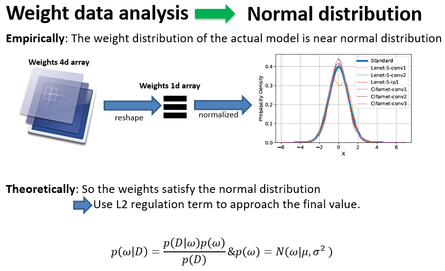
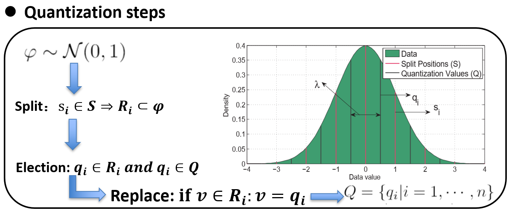
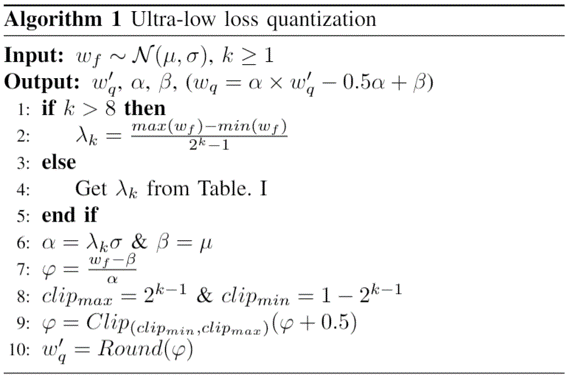

# $\mu$L2Q: An Ultra-Low Loss Quantization Method for DNN Compression

## This method has been merged into [Quantization-caffe](https://github.com/GongCheng1919/Quantization-caffe). Please go to [Quantization-caffe](https://github.com/GongCheng1919/Quantization-caffe) for detailed introduction.

## $\mu$L2Q quantization method
- Firstly, by analyzing the data distribution of the model, 
we find that the weight distribution of most models obeys the 
normal distribution approximately, and the regularization term 
based on theoretical deduction (L2) also shows that the weight 
of the model will be constrained to approach the normal distribution 
in the training process.

- Based on the analysis of model weight distribution, 
our method quantifies uniformly (\lambda interval) data $\varphi$ with standard normal 
distribution to discrete value set Q, and minimize the 
L2 distance before and after quantization.


## Algorithm



## Experiments
Our experiment is divided into two parts: simulation data evaluation and model testing.
### Simulation data evaluation
- We generate normal distribution data, then quantize the data with different binary 
quantization methods, and draw data curves before and after quantization. It can be 
seen that our quantization method is closest to the original data after quantization.

### Model testing


Please cite our works in your publications if it helps your research:
```
@article{cheng2019uL2Q,
  title={$\mu$L2Q: An Ultra-Low Loss Quantization Method for DNN},
  author={Cheng, Gong and Ye, Lu and Tao, Li and Xiaofan, Zhang and Cong, Hao and Deming, Chen and Yao, Chen},
  journal={The 2019 International Joint Conference on Neural Networks (IJCNN)},
  year={2019}
}
```

