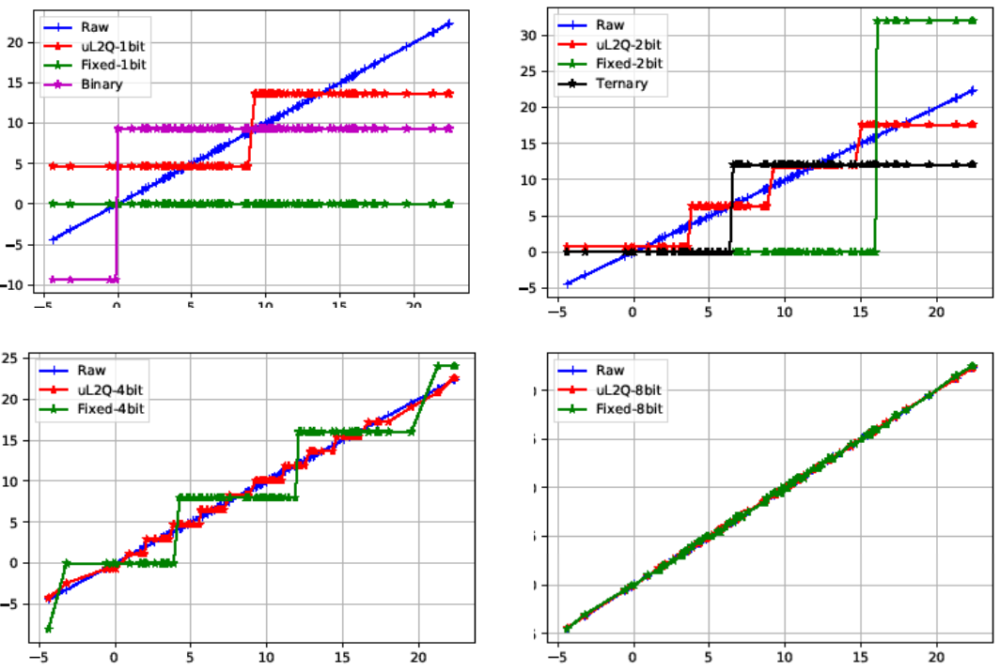

# $\mu$L2Q: An Ultra-Low Loss Quantization Method for DNN Compression
$\mu$L2Q: This open-source package introduces an ultra-low loss quantization (μL2Q) method that provides DNN quantization schemes based on comprehensive quantitative data analysis. μL2Q builds the transformation of the original data to a data space with standard normal distribution, and then finds the optimal parameters to minimize the loss of the quantization of a target bitwidth. Our method can deliver consistent accuracy improvements compared to the state-of-the-art quantization solutions with the same compression ratio.

## This method has been merged into [Quantization-caffe](https://github.com/GongCheng1919/Quantization-caffe).
Please go to [Quantization-caffe](https://github.com/GongCheng1919/Quantization-caffe) for detail information..

## Method
- Firstly, by analyzing the data distribution of the model, 
we find that the weight distribution of most models obeys the 
normal distribution approximately, and the regularization term 
based on theoretical deduction (L2) also shows that the weight 
of the model will be constrained to approach the normal distribution 
in the training process.

- Based on the analysis of model weight distribution, 
our method quantifies uniformly (\lambda interval) data $\varphi$ with standard normal 
distribution to discrete value set Q, and minimize the 
L2 distance before and after quantization.


## Algorithm


## DNN Training
- Using the gradient of quantization weight to approximate the gradient of full precision weight


## Experiments
Our experiment is divided into two parts: simulation data evaluation and model testing.
### Simulation data evaluation
- We generate normal distribution data, then quantize the data with different binary 
quantization methods, and draw data curves before and after quantization. It can be 
seen that our quantization method is closest to the original data after quantization.

### Model testing
- We select three representative datasets and four models with different sizes.

- The experimental results are the comparison of the same model output accuracy，which
 quantized by different quantization methods (Binary, Ternary and fixed-point). 


### citation
Please cite our works in your publications if it helps your research:
```
@article{cheng2019uL2Q,
  title={$\mu$L2Q: An Ultra-Low Loss Quantization Method for DNN},
  author={Cheng, Gong and Ye, Lu and Tao, Li and Xiaofan, Zhang and Cong, Hao and Deming, Chen and Yao, Chen},
  journal={The 2019 International Joint Conference on Neural Networks (IJCNN)},
  year={2019}
}
```

